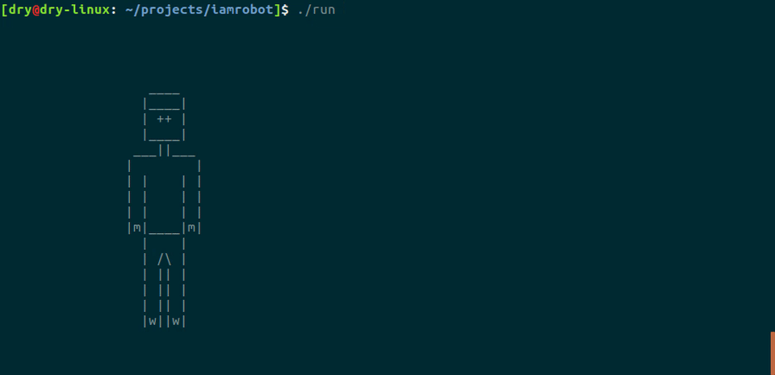

# I AM ROBOT

Simple control system of robot in terminal.

## Directory

```shell
.
├── act
│   ├── stand
│   │   └── 0.txt
│   ├── walk_left
│   │   ├── 0.txt
│   │   ├── 1.txt
│   │   ├── 2.txt
│   │   ├── 3.txt
│   │   ├── 4.txt
│   │   └── 5.txt
│   └── walk_right
│       ├── 0.txt
│       ├── 1.txt
│       ├── 2.txt
│       ├── 3.txt
│       ├── 4.txt
│       └── 5.txt
├── bin
│   └── run
├── Makefile
├── obj
│   ├── main.o
│   └── robot.o
├── README.md
├── run
└── src
    ├── main.c
    ├── robot.c
    └── robot.h
```

## Usage

You just need **GNU/Linux** and **GCC**, download the repository and complie source code.

```shell
$ git clone https://github.com/graycat0918/i-am-robot.git
$ cd i-am-robot/
$ make
```
Execute the file named 'run' to start a control system, and press `Esc` to quit.

```shell
$ ./run
```
Press **`W`** / **`A`** / **`S`** / **`D`** to control robot.

The effect is like **[the following GIF image](https://github.com/graycat0918/i-am-robot/blob/master/img/ctrl-sys.gif)** (Make sure your network is OK and **wait the image** for a moment).


