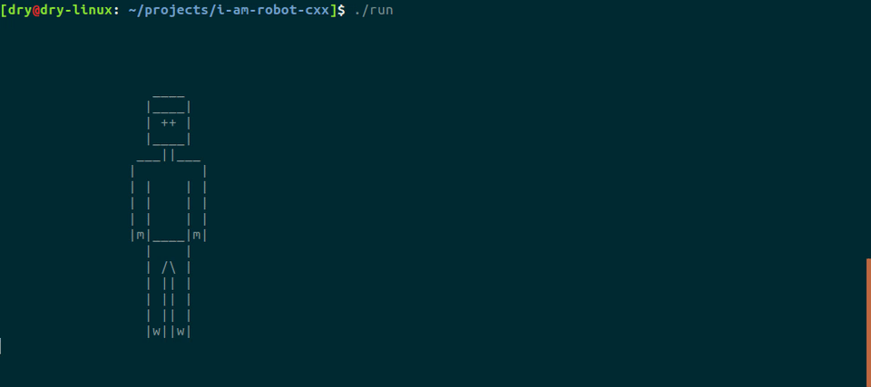

# I AM ROBOT (CXX Version)

A simple control system of robot in terminal.
You can also see **[another version](https://github.com/graycat0918/i-am-robot)** which coded by C language.

## Directory

```shell
.
├── act
│   ├── act_0
│   │   ├── attribute.txt
│   │   └── step_0.txt
│   ├── act_1
│   │   ├── attribute.txt
│   │   ├── step_0.txt
│   │   ├── step_1.txt
│   │   ├── step_2.txt
│   │   ├── step_3.txt
│   │   ├── step_4.txt
│   │   └── step_5.txt
│   ├── act_2
│   │   ├── attribute.txt
│   │   ├── step_0.txt
│   │   ├── step_1.txt
│   │   ├── step_2.txt
│   │   ├── step_3.txt
│   │   ├── step_4.txt
│   │   └── step_5.txt
│   └── attribute.txt
├── bin
│   └── run
├── img
│   └── ctrl-sys.gif
├── Makefile
├── obj
│   ├── action.o
│   ├── func.o
│   ├── main.o
│   ├── robot.o
│   ├── step.o
│   └── window.o
├── README.md
├── run
└── src
    ├── action.cxx
    ├── action.h
    ├── func.c
    ├── func.h
    ├── main.cxx
    ├── robot.cxx
    ├── robot.h
    ├── step.cxx
    ├── step.h
    ├── window.cxx
    └── window.h
```

## Usage

You just need **GNU/Linux** and **GCC**, download the repository and complie source code.

```shell
$ git clone https://github.com/graycat0918/i-am-robot-cxx.git
$ cd i-am-robot-cxx/
$ make
```
Execute the file named 'run' to start a control system, and press `Esc` to quit.

```shell
$ ./run
```
Press **`W`** / **`A`** / **`S`** / **`D`** to control robot.

The effect is like **[the following GIF image](https://github.com/graycat0918/i-am-robot-cxx/blob/master/img/ctrl-sys.gif)** (Make sure your network is OK and **wait the image** for a moment).


